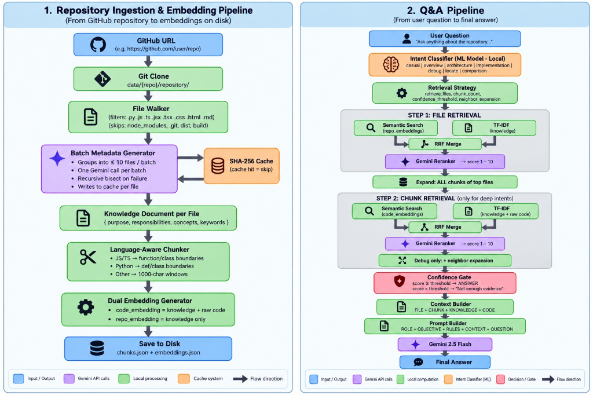

# 🧠 A.I. Codebase Mentor

> **An intelligent Q&A system for any public GitHub repository — powered by Gemini 2.5 Flash, sentence embeddings, hybrid retrieval, and a locally-trained intent classifier.**

A.I. Codebase Mentor lets developers drop in any GitHub URL and immediately start asking natural-language questions about the codebase — *"How does authentication work?"*, *"Where is the WebSocket logic?"*, *"What's the overall architecture?"* — and receive grounded, context-accurate answers drawn directly from the source code.

---

## ✨ Key Features

| Feature | Details |
|---|---|
| 🔍 **Hybrid Retrieval** | Combines semantic (vector) search with TF-IDF keyword search, fused via Reciprocal Rank Fusion (RRF) |
| 🤖 **Local Intent Classifier** | Logistic Regression model trained on sentence embeddings — classifies 7 distinct question intents with no API call |
| ♻️ **SHA-256 Metadata Cache** | Gemini API calls are skipped whenever a file hasn't changed — resumable, crash-safe indexing |
| 📦 **Batch LLM Metadata** | Up to 10 files per Gemini call; recursive bisect on failure — eliminates rate-limit issues |
| 🎯 **Gemini Reranker** | Relevance scores (1–10) from Gemini ensure only the most on-point context reaches the final prompt |
| 🔒 **Confidence Gate** | A score threshold prevents hallucinated answers when evidence is insufficient |
| ⚡ **Live Indexing** | `/index/live` endpoint clones and indexes any public GitHub repo on demand |
| 🎨 **Vanilla Frontend** | Pure HTML/CSS/JS — no framework required |

---

## 🗺️ System Architecture

The system is split into two independent pipelines that work in sequence: first the codebase is ingested and indexed, then the Q&A pipeline answers questions using that index.





---

## 📦 Pipeline 1 — Repository Ingestion & Embedding

> *Transforms a raw GitHub URL into a set of searchable, semantically-rich chunks stored on disk.*

```
GitHub URL → Git Clone → File Walker → Batch Metadata Generator → Chunker → Embedding Generator → Disk
```

### Stage 1 · Git Clone

**File:** `indexing/repository_manager.py`

The pipeline begins with a raw GitHub URL (e.g. `https://github.com/user/repo`). The repository is cloned into `data/{repo_name}/repository/` using `git clone`. If the repository already exists locally, the system checks the remote `HEAD` commit hash against the stored hash and **only re-indexes if the code has actually changed**.

---

### Stage 2 · File Walker

**File:** `indexing/file_reader.py`

A recursive `os.walk` traverses the cloned repo tree and collects every file that matches the supported extension list:

```
Allowed: .py  .js  .jsx  .ts  .tsx  .css  .html  .json  .md  .txt
Skipped: node_modules/  .git/  __pycache__/  venv/  dist/  build/
Ignored: package-lock.json  yarn.lock  pnpm-lock.yaml
```

Each collected file is read as UTF-8 text and assembled into a list of `{ path, content }` dicts ready for metadata generation.

---

### Stage 3 · Batch Metadata Generator + SHA-256 Cache

**Files:** `indexing/llm_metadata_batch_generator.py` · `indexing/metadata_cache.py` · `indexing/batch_indexer.py`

This is the most sophisticated stage in the pipeline. For every file, the system needs a *knowledge document* describing what the file does — but generating one Gemini call per file is rate-limit-prohibitive for large repos.

#### SHA-256 Cache (cache hit = skip)

Before calling Gemini at all, each file's content is hashed using SHA-256. The hash is compared against `metadata_cache/{repo_name}/{relative_path}.json`. If the hash matches, the cached metadata is returned immediately — **zero API calls**.

```python
current_hash = hashlib.sha256(content.encode("utf-8")).hexdigest()
# Cache hit → return cached metadata instantly
# Cache miss → add to batch for Gemini
```

#### Batched Gemini Calls (≤10 files per call)

Cache misses are grouped into token-budget-aware batches (≈6,000 characters / 10 files max). A single Gemini call processes the entire batch at once, returning a JSON array of metadata objects — one per file.

```
[batch of up to 10 files] → 1 Gemini call → [{purpose, responsibilities, concepts, keywords}, ...]
```

#### Recursive Bisect on Failure

If a batch call fails (rate limit, malformed JSON, size mismatch) after exponential-backoff retries, the batch is **bisected in half** and each half is retried independently — all the way down to single files if needed. At the single-file level, the original `llm_metadata_generator` is used as the final fallback. This ensures **no file is silently dropped**.

```
Batch of 10 fails → retry Batch[0:5] + Batch[5:10]
Batch[0:5] fails  → retry Batch[0:2] + Batch[2:5]
...
Single file fails  → placeholder metadata (never crashes)
```

#### Generated Metadata Shape

For each file, Gemini returns:

```json
{
  "purpose": "One or two sentence description of what this file does",
  "responsibilities": ["Handles authentication", "Validates JWT tokens", "..."],
  "concepts": ["Middleware", "OAuth2", "Session management"],
  "keywords": ["auth", "login", "token", "session", "jwt", "verify"]
}
```

---

### Stage 4 · Knowledge Document Builder

**File:** `indexing/build_document.py`

The raw metadata dict is formatted into a human-readable *knowledge document* string. This document is attached to every chunk and is the primary text surface used during file-level semantic search:

```
Purpose: Handles JWT-based authentication for the API layer.
Responsibilities: Validate tokens | Issue access/refresh pairs | Block expired sessions
Concepts: OAuth2, Middleware, JWT, Session
Keywords: auth, login, token, session, jwt, verify, refresh
```

---

### Stage 5 · Language-Aware Chunker

**File:** `indexing/chunker.py`

Files are split into semantically meaningful chunks rather than arbitrary line-count windows. The splitting strategy is language-aware:

| Language | Split Strategy |
|---|---|
| `.js` `.jsx` `.ts` `.tsx` | Regex split on `function`, `class`, `export default`, `const X = (` boundaries |
| `.py` | Regex split on `def` and `class` boundaries |
| `.css` | Split on closing `}` brace boundaries |
| All others (`.html`, `.md`, `.json`, …) | Fixed 1,000-character sliding windows |

Each chunk carries forward all its parent file's metadata:

```json
{
  "id": "src/auth.js_3",
  "path": "src/auth.js",
  "chunk_id": 3,
  "module_type": "backend",
  "file_type": "js",
  "knowledge_document": "Purpose: ...\nResponsibilities: ...",
  "content": "function verifyToken(token) { ... }"
}
```

---

### Stage 6 · Dual Embedding Generator

**File:** `indexing/embedding_generator.py`

Two distinct vector embeddings are generated per chunk using **`sentence-transformers/all-MiniLM-L6-v2`** (runs fully locally — no API call):

| Embedding | Input text | Used for |
|---|---|---|
| `code_embedding` | `knowledge_document + raw code` | Chunk-level semantic search |
| `repo_embedding` | `knowledge_document only` | File-level semantic search |

The dual-embedding design means file-level queries match against clean semantic descriptions, while deep-dive queries can match against the actual implementation code.

---

### Stage 7 · Save to Disk

**File:** `utils/storage.py`

Two JSON files are written to `data/{repo_name}/`:

- **`chunks.json`** — array of all chunk dicts (id, path, content, knowledge_document, …)
- **`embeddings.json`** — array of `{ id, code_embedding, repo_embedding }` dicts

These are the only files the Q&A pipeline ever reads — the ingestion pipeline is completely separate.

---

## 💬 Pipeline 2 — Q&A Pipeline

> *Transforms a natural-language question into a grounded, context-rich answer.*

```
User Question → Intent Classifier → Retrieval Strategy → File Retrieval → Chunk Retrieval → Confidence Gate → Context Builder → Prompt Builder → Gemini 2.5 Flash → Answer
```

### Stage 1 · Intent Classifier (Local ML Model)

**Files:** `core/question_classifier.py` · `classifier/train_classifier.py`

Before any retrieval begins, the user's question is classified into one of **7 intents** by a locally-trained machine learning model:

| Intent | Example Question |
|---|---|
| `casual` | "Hey, what's up?" |
| `overview` | "What does this repository do?" |
| `architecture` | "How do the components talk to each other?" |
| `implementation` | "How does the login flow work?" |
| `debug` | "Why would this function throw a null error?" |
| `locate` | "Where is the WebSocket handler?" |
| `comparison` | "What's the difference between these two auth methods?" |

**How it works:** The question is encoded into a vector using `all-MiniLM-L6-v2`, then classified by a `LogisticRegression` model trained on a curated dataset of labeled questions. Everything runs **locally in milliseconds** — no Gemini call, no latency.

The model artifacts (`intent_classifier.pkl`, `label_encoder.pkl`) live in `classifier/models/` and are loaded once at server startup.

---

### Stage 2 · Retrieval Strategy

**File:** `core/retrieval_strategy.py`

The detected intent maps to a **retrieval strategy config** that controls every parameter of what follows:

```python
RETRIEVAL_STRATEGIES = {
    "overview":        { retrieve_files: 6, retrieve_chunks: False, confidence_threshold: 4, ... },
    "architecture":    { retrieve_files: 5, retrieve_chunks: True,  chunk_count: 5, ... },
    "debug":           { retrieve_files: 3, retrieve_chunks: True,  neighbor_expansion: True, ... },
    "implementation":  { retrieve_files: 3, retrieve_chunks: True,  chunk_count: 6, ... },
    "comparison":      { retrieve_files: 4, retrieve_chunks: True,  chunk_count: 6, ... },
    "locate":          { retrieve_files: 2, retrieve_chunks: False, preview_chunks: 2, ... },
    "casual":          { retrieve_files: 0, ...  }  # no retrieval
}
```

Key parameters:

| Parameter | Meaning |
|---|---|
| `retrieve_files` | How many top-level files to fetch in Step 1 |
| `retrieve_chunks` | `True` = deep chunk search; `False` = preview mode |
| `preview_chunks` | In preview mode, how many leading chunks per file to include |
| `chunk_count` | In retrieval mode, how many final chunks to return |
| `neighbor_expansion` | Also include the chunk before/after each result (for `debug`) |
| `confidence_threshold` | Minimum Gemini reranker score (1–10) required to answer |

---

### Stage 3 · Step 1 — File Retrieval

**Files:** `core/strategy_executor.py` · `retrieval/repo_retriever.py` · `retrieval/keyword_retriever.py` · `retrieval/hybrid_retriever.py` · `retrieval/reranker.py`

The first retrieval step finds the most relevant **files** (not chunks) using a three-substep pipeline:

#### 3a · Semantic Search (repo_embeddings)

The question is encoded with `all-MiniLM-L6-v2` and compared against every file's `repo_embedding` (knowledge document only) using cosine similarity. Top-K files are returned.

#### 3b · TF-IDF Keyword Search (knowledge documents)

A TF-IDF vectorizer runs keyword matching across all knowledge documents. This catches exact terminology that semantic search might miss.

#### 3c · RRF Merge

Results from semantic and keyword search are merged using **Reciprocal Rank Fusion**:

```
RRF score = Σ 1 / (k + rank_in_list)   [k=60 by default]
```

This gives a unified ranking that rewards files that appear highly in *both* lists.

#### 3d · Gemini Reranker (1–10 score)

Gemini 2.5 Flash reads the question and the top merged results, then assigns each a relevance score from 1 to 10. Results are sorted by score. The top score is stored as `top_file_score`.

---

### Stage 4 · File Expansion

**File:** `core/strategy_executor.py`

After reranking, **all chunks from the top-K files** are collected into a single expanded pool. This guarantees complete file coverage before chunk-level search begins.

---

### Stage 5 · Step 2 — Chunk Retrieval (deep intents only)

**Files:** `retrieval/retriever.py` · `retrieval/keyword_retriever.py` · `retrieval/hybrid_retriever.py` · `retrieval/reranker.py`

For intents that need precise code-level context (`architecture`, `implementation`, `debug`, `comparison`), a second round of hybrid retrieval runs **within** the expanded chunk pool:

#### 5a · Semantic Search (code_embeddings)

The question is compared against each chunk's `code_embedding` (knowledge document + raw code). This finds chunks with the actual implementation detail.

#### 5b · TF-IDF on Raw Code + Knowledge

Keyword search now runs over knowledge documents *and* raw source code, catching function names, variable names, and identifiers.

#### 5c · RRF Merge + Gemini Reranker

Same RRF + Gemini reranking cycle as file retrieval, but at chunk granularity. The output is a scored, ranked list of the most relevant code chunks.

#### 5d · Neighbor Expansion (debug intent only)

For `debug` questions, the chunk immediately *before* and *after* each retrieved chunk is also included. Surrounding code often holds the root cause of a bug — this prevents the LLM from seeing a function in isolation.

---

### Stage 6 · Confidence Gate

**File:** `core/confidence_handler.py`

The top Gemini reranker score is checked against the strategy's `confidence_threshold`:

```
score ≥ threshold  →  proceed to answer
score < threshold  →  return "Not enough evidence" message
```

This is the system's protection against hallucination. If the retrieved context isn't relevant enough, the system honestly says so instead of fabricating an answer.

---

### Stage 7 · Context Builder

**File:** `core/context_builder.py`

The final selected chunks are formatted into a structured context block:

```
FILE: src/auth.js
CHUNK: 3
KNOWLEDGE: Purpose: Handles JWT authentication...
CODE:
function verifyToken(token) { ... }
---
```

Each chunk section includes the file path, knowledge document, and raw code — giving the LLM all the information it needs to answer accurately.

---

### Stage 8 · Prompt Builder

**File:** `core/prompt_builder.py`

A structured prompt is assembled from five components, tailored to the classified intent:

```
ROLE        : "You are a senior software architect..."
OBJECTIVE   : "Explain the architecture of the system..."
RULES       : Intent-specific constraints (e.g. "Focus on component interactions")
GLOBAL RULES: "Answer ONLY from the retrieved context. Never invent code or files."
CONTEXT     : The formatted code chunks from Stage 7
QUESTION    : The user's original question
```

Each of the 7 intents has its own prompt template with a specific role, objective, rules, and structured answer format. For example, `overview` prompts produce `## Repository Summary`, `## Tech Stack`, `## Main Components` sections. `debug` prompts are instructed to reason about root causes and suggest fixes.

---

### Stage 9 · Gemini 2.5 Flash → Final Answer

**File:** `llm/llm_explainer.py`

The completed prompt is sent to **Gemini 2.5 Flash** which generates the final markdown-formatted answer. The response is returned to the frontend along with the detected `intent` and `confidence` score.

```json
{
  "answer": "## Architectural Overview\n\nThe repository...",
  "intent": "architecture",
  "confidence": 8
}
```

---

## 🗂️ Project Structure

```
A.I._Codebase_Mentor/
│
├── api.py                      # Flask app — REST endpoints (/, /repos, /ask, /index)
├── live_index_routes.py        # Blueprint — /index/live endpoint for any GitHub URL
├── script.py                   # CLI entry point (legacy / dev use)
│
├── indexing/                   # Pipeline 1 — Ingestion
│   ├── repository_manager.py   # Clone, re-index, commit-hash checking
│   ├── file_reader.py          # File walker + orchestrator
│   ├── batch_indexer.py        # Cache-aware batch dispatcher
│   ├── llm_metadata_batch_generator.py  # Batch Gemini calls + bisect retry
│   ├── llm_metadata_generator.py        # Single-file Gemini fallback
│   ├── metadata_cache.py       # SHA-256 file cache
│   ├── build_document.py       # Knowledge document formatter
│   ├── chunker.py              # Language-aware chunker
│   ├── embedding_generator.py  # Dual embedding generator (all-MiniLM-L6-v2)
│   └── metadata_extractor.py   # Module/file-type detector
│
├── retrieval/                  # Retrieval primitives
│   ├── repo_retriever.py       # File-level semantic search (repo_embeddings)
│   ├── retriever.py            # Chunk-level semantic search (code_embeddings)
│   ├── keyword_retriever.py    # TF-IDF keyword search
│   ├── hybrid_retriever.py     # Reciprocal Rank Fusion (RRF) merger
│   └── reranker.py             # Gemini relevance reranker (1–10 scores)
│
├── core/                       # Pipeline 2 — Q&A orchestration
│   ├── question_classifier.py  # Local ML intent classifier
│   ├── retrieval_strategy.py   # Strategy configs per intent
│   ├── strategy_executor.py    # 3-step retrieval orchestrator
│   ├── context_builder.py      # Formats chunks into LLM context
│   ├── prompt_builder.py       # Assembles full structured prompts
│   └── confidence_handler.py   # Score threshold + low-confidence message
│
├── classifier/                 # ML model training workspace
│   ├── train_classifier.py     # Trains LogisticRegression intent classifier
│   ├── dataset_generator.py    # Generates training examples
│   ├── datasets/               # processed/ train.json, validation.json, test.json
│   └── models/                 # intent_classifier.pkl, label_encoder.pkl
│
├── llm/
│   └── llm_explainer.py        # Thin wrapper around Gemini generate_content()
│
├── utils/
│   ├── helpers.py              # Chunkmap/embeddingmap builders, TF-IDF doc builders
│   └── storage.py              # JSON load/save helpers
│
├── frontend/
│   ├── index.html              # Single-page application shell
│   ├── app.js                  # Fetch calls, UI state management
│   └── style.css               # Styling
│
└── data/                       # Generated at runtime — not committed
    └── {repo_name}/
        ├── chunks.json
        ├── embeddings.json
        └── repository/         # Cloned source code
```

---

## 🚀 Getting Started

### Prerequisites

- Python 3.10+
- Git (must be in PATH)
- A **Gemini API key** (free tier works for most repos)

### 1. Clone the Project

```bash
git clone https://github.com/your-username/A.I._Codebase_Mentor.git
cd A.I._Codebase_Mentor
```

### 2. Install Dependencies

```bash
pip install flask flask-cors google-generativeai sentence-transformers scikit-learn joblib python-dotenv
```

### 3. Configure Environment

Create a `.env` file in the project root:

```env
GEMINI_API_KEY=your_gemini_api_key_here
```

### 4. Start the Server

```bash
python api.py
```

The app will be available at **http://localhost:5000**.

### 5. Index a Repository

**Via the UI:** Paste a GitHub URL into the input field and click "Index Repository".

**Via the API:**
```bash
curl -X POST http://localhost:5000/index/live \
  -H "Content-Type: application/json" \
  -d '{"url": "https://github.com/user/repo"}'
```

### 6. Ask Questions

Once indexed, select the repo from the dropdown and ask anything:

```
"What does this project do?"
"How does the authentication system work?"
"Where is the database connection initialized?"
"Why would the WebSocket handler drop connections?"
```

---

## 🔌 API Reference

| Method | Endpoint | Description |
|---|---|---|
| `GET` | `/repos` | List all indexed repositories |
| `GET` | `/repos/{name}/stats` | Get file/chunk count for an indexed repo |
| `POST` | `/index` | Demo endpoint (cached repos only) |
| `POST` | `/index/live` | Index any public GitHub repo on demand |
| `POST` | `/ask` | Run the full Q&A pipeline |

### POST `/ask`

**Request:**
```json
{
  "repo": "SyncSphere-Website",
  "question": "How does real-time sync work?"
}
```

**Response:**
```json
{
  "answer": "## Implementation Detail\n\nReal-time sync is handled by...",
  "intent": "implementation",
  "confidence": 9
}
```

### POST `/index/live`

**Request:**
```json
{ "url": "https://github.com/user/repo" }
```

**Response:**
```json
{
  "status": "ready",
  "repo_name": "repo",
  "file_count": 42,
  "chunk_count": 187,
  "message": "'repo' indexed and ready to answer questions."
}
```

---

## 🧪 Training the Intent Classifier

The pre-trained model is included in `classifier/models/`. To retrain on your own data:

```bash
# 1. Generate or edit the dataset
python classifier/dataset_generator.py

# 2. Train the classifier
python classifier/train_classifier.py

# The new model is saved to classifier/models/ automatically
```

The classifier uses `all-MiniLM-L6-v2` embeddings + Logistic Regression and typically achieves >95% accuracy on the 7-intent dataset.

---

## ⚙️ How the Confidence System Works

The confidence gate prevents the system from hallucinating answers when no good context exists. Gemini scores every retrieved result from 1 to 10. If the best score is below the intent's threshold, the system returns a transparent refusal:

```
"I couldn't find enough specific context in this repository to answer your
question with confidence. You might want to rephrase or check if this
topic exists in the codebase."
```

| Intent | Threshold | Reason |
|---|---|---|
| `overview` | 4 | Overview questions can use loosely-related context |
| `locate` | 4 | Location questions are forgiving — even partial matches help |
| `architecture` | 5 | Needs moderately specific context |
| `implementation` | 5 | Needs specific code |
| `comparison` | 5 | Needs both sides of the comparison |
| `debug` | 6 | Debug answers need precise code to avoid misleading fixes |

---

## 🔧 Design Decisions

### Why Dual Embeddings?

File-level search (`repo_embedding`) uses only the knowledge document — a clean semantic description of what the file does. This prevents large raw code files from drowning out the semantic signal. Chunk-level search (`code_embedding`) adds the raw code back so that implementation-specific queries can match function signatures, variable names, and logic patterns.

### Why a Local Classifier Instead of Asking Gemini to Classify?

Routing every question through Gemini to determine intent would add ~500–1500ms of latency before retrieval even starts. The local `all-MiniLM-L6-v2 + LogisticRegression` pipeline classifies in under 50ms with no API cost.

### Why Batch + Bisect for Metadata?

A naive one-Gemini-call-per-file approach for a 100-file repo means 100 sequential API calls with rate-limit waits — often taking 30–45 minutes. Batching reduces this to ~10 calls. The bisect-on-failure strategy ensures full coverage even under transient quota errors, without requiring manual restarts.

### Why RRF Instead of a Weighted Average?

Reciprocal Rank Fusion is robust to score scale differences between semantic cosine similarity and TF-IDF scores. It rewards results that rank highly in *both* systems without needing to normalize or tune weights between them.

---

## 📄 License

MIT License — see [LICENSE](LICENSE) for details.

---

## 🙏 Acknowledgements

- [Google Gemini API](https://ai.google.dev/) — LLM backbone for metadata generation, reranking, and final answers
- [Sentence Transformers](https://www.sbert.net/) — `all-MiniLM-L6-v2` for fast local embeddings
- [scikit-learn](https://scikit-learn.org/) — Logistic Regression intent classifier and TF-IDF retrieval
- [Flask](https://flask.palletsprojects.com/) — Lightweight Python web framework
